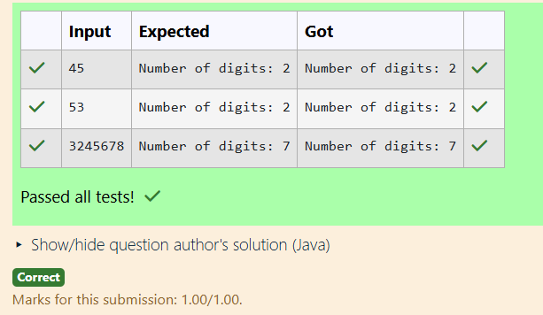

# EX3 Write a program to count the number of digits in an integer.
## DATE: 21.1.26
## AIM:
To write a C program to implement Tower of Hanoi

## Algorithm
1.Start the program.

2.Read an integer num from the user.

3.Initialize count = 0.

4.If num is 0, set count = 1.

5.Otherwise, repeatedly divide num by 10 and increment count until num becomes 0.

6.Print count and stop.

## Program:
```
/*
Program to to count the number of digits in an integer
Developed by: Sri Yaline R
RegisterNumber: 212224040325
*/

import java.util.Scanner;

public class CountDigits {
    public static void main(String[] args) {
        Scanner sc = new Scanner(System.in);
        
        // Read the number from user
        int num = sc.nextInt();
        int count = 0;

        // Count digits
        if (num == 0) {
            count = 1;
        } else {
            while (num != 0) {
                count++;
                num /= 10;
            }
        }

        System.out.println("Number of digits: " + count);
    }
}
```

## Output:



## Result:
Thus, the Java program to to count the number of digits in an integer is implemented successfully.
