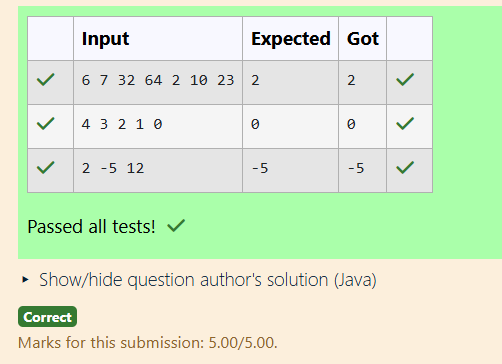

# EX 1 You’re creating a health monitoring device which stores several sensor readings in an array. To determine the minimum value (e.g., lowest heartbeat), implement a recursive method.
## DATE: 21.1.26
## AIM:
To write a JAVA program To determine the minimum value (e.g., lowest heartbeat), implement a recursive method.

## Algorithm
1.Start

2.Read the number of sensor readings n

3.Read n sensor readings into an array arr[]

4.Call a recursive function findMin(arr, n) to find the minimum value

  Base case: If array size is 1, return the only element

  Recursive case: Compare the last element with the minimum of the rest

5.Display the minimum value

6.Stop   

## Program:
```
/*
Program To determine the minimum value (e.g., lowest heartbeat), implement a recursive method.
Developed by: Sri Yaline R
RegisterNumber: 212224040325
*/

import java.util.*;

public class Main {
    static int getMin(int[] arr, int i, int n) 
    {
        // Type Your Code Here
        if (i == n - 1) {
            return arr[i];
        }

        // Recursive call to find minimum in remaining array
        int minRest = getMin(arr, i + 1, n);

        // Return smaller value
        return Math.min(arr[i], minRest);
        
    }

    public static void main(String[] args) {
        Scanner sc = new Scanner(System.in);
        int n = sc.nextInt();
        int[] arr = new int[n];
        for(int i=0; i<n; i++) {
            arr[i] = sc.nextInt();
        }
        System.out.println(getMin(arr, 0, n));
    }
}

```

## Output:



## Result:
Thus the JAVA prograM ti find the minimum value (e.g., lowest heartbeat), implement a recursive method has implemented successfully
