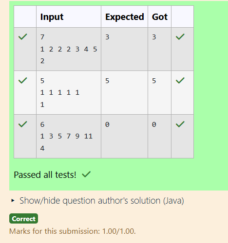

# Ex2 Count how many times a number appears in an array recursively.
## DATE:
## AIM:
To write a Java program to Count how many times a number appears in an array recursively.

## Algorithm 
1.Start the program

2.Read the size of the array n.

3.Create an array of size n and read n elements into it.

4.Read the target value t to be counted.

5.Initialize a counter c = 0 and traverse the array:

  For each element, if it equals t, increment c by 1.

6.Print the value of c (number of occurrences) and stop.   

## Program:
```
/*
Program Count how many times a number appears in an array recursively.
Developed by: Sri Yaline R
RegisterNumber: 212224040325
*/

import java.util.*;
public class main
{
    public static void main(String[] ags)
    {
        Scanner s=new Scanner(System.in);
        int n=s.nextInt();
        int[] arr=new int[n];
        for(int i=0;i<n;i++)
        {
            arr[i]=s.nextInt();
        }
        int t=s.nextInt();
        int c=0;
        for(int i=0;i<n;i++)
        {
            if(arr[i]==t)
            {
                c++;
            }
        }
        System.out.print(c);
    }
}
```

## Output:



## Result:
Thus, the Java program to Count how many times a number appears in an array recursively is implemented successfully.
