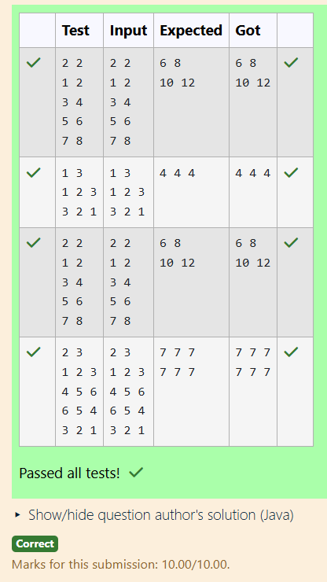

# Ex4 You are given a Java program that performs matrix addition. If Matrix A has all odd numbers and Matrix B has all even numbers of the same dimension, what will be the nature (even/odd/mixed) of the resulting matrix?
## DATE: 23.1.26
## AIM:
To write a java function to evaluate weather the given Matrix A has all odd numbers and Matrix B has all even numbers of the same dimension and find the nature of resultant matrrix.

## Algorithm
1.Start the program.

2.Read the number of rows and columns.

3.Create two matrices A and B of the given size.

4.Read elements for Matrix A and Matrix B from the user.

5.Add corresponding elements of A and B and store in a sum matrix.

6.Print the sum matrix and stop.   

## Program:
```
/*
Program to ind the nature of resultant matrrix.
Developed by: Sri Yaline R
RegisterNumber: 212224040325  
*/

import java.util.Scanner;

public class MatrixAddition {
    public static void main(String[] args) {
        Scanner sc = new Scanner(System.in);

        // Read matrix size
        int rows = sc.nextInt();
        int cols = sc.nextInt();

        int[][] A = new int[rows][cols];
        int[][] B = new int[rows][cols];
        int[][] sum = new int[rows][cols];

        // Read Matrix A
        for (int i = 0; i < rows; i++) {
            for (int j = 0; j < cols; j++) {
                A[i][j] = sc.nextInt();
            }
        }

        // Read Matrix B
        for (int i = 0; i < rows; i++) {
            for (int j = 0; j < cols; j++) {
                B[i][j] = sc.nextInt();
            }
        }

        // Matrix Addition
        for (int i = 0; i < rows; i++) {
            for (int j = 0; j < cols; j++) {
                sum[i][j] = A[i][j] + B[i][j];
            }
        }

        // Print Result
        for (int i = 0; i < rows; i++) {
            for (int j = 0; j < cols; j++) {
                System.out.print(sum[i][j] + " ");
            }
            System.out.println();
        }

        sc.close();
    }
}

```

## Output:



## Result:
Thus, the java program to evaluate weather the given Matrix A has all odd numbers and Matrix B has all even numbers of the same dimension and find the nature of resultant matrrix is implemented successfully.
