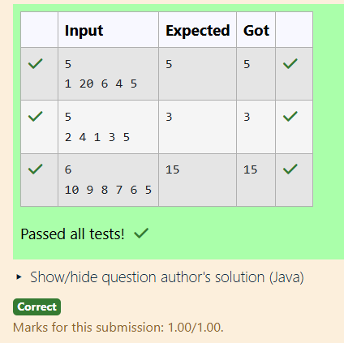

# Ex5 Count Inversions in an Array
## DATE: 24.1.26
## AIM:
To write a Java program  to Count the number of inversions in an array where inversion is defined as: arr[i] > arr[j] and i < j

## Algorithm
1.Start the program.

2.Read the number of elements n.

3.Read n numbers into an array.

4.Initialize count = 0.

5.Compare each element with all elements after it; if the first is bigger, increment count.

6.Print count and stop.  

## Program:
```
/*
Program toto Count the number of inversions in an array where inversion is defined as: arr[i] > arr[j] and i < j
Developed by: Sri Yaline R
RegisterNumber: 212224040325
*/

import java.util.Scanner;

public class Main {
    public static void main(String[] args) {
        Scanner sc = new Scanner(System.in);

        int n = sc.nextInt();
        int[] arr = new int[n];

        for (int i = 0; i < n; i++) {
            arr[i] = sc.nextInt();
        }

        int count = 0;

        // Count inversions
        for (int i = 0; i < n; i++) {
            for (int j = i + 1; j < n; j++) {
                if (arr[i] > arr[j]) {
                    count++;
                }
            }
        }

        System.out.println(count);
    }
}
```

## Output:



## Result:
Thus the Java program to to Count the number of inversions in an array where inversion is defined as: arr[i] > arr[j] and i < jis implemented successfully.
